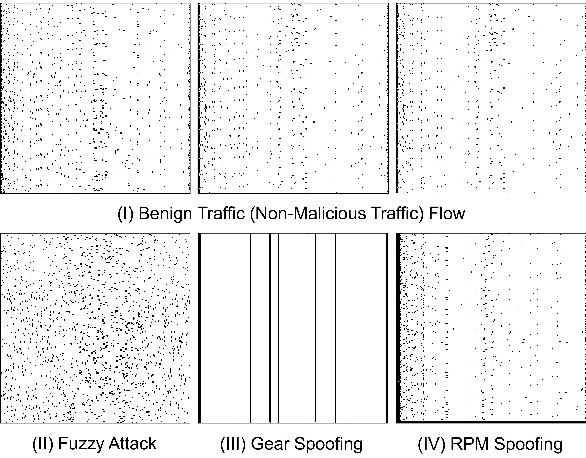
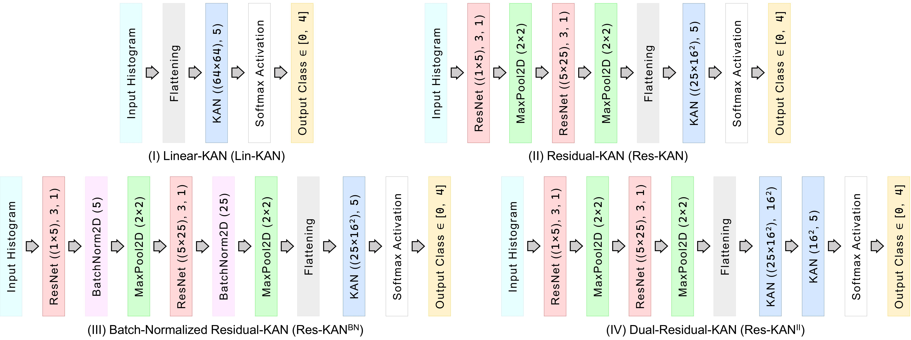

# `RISK-4-Auto`: Residually Interconnected and Superimposed Kolmogorov-Arnold Networks for Automotive Network Traffic Classification

The Controller Area Network (CAN) bus in vehicles facilitates communication but is vulnerable to malicious attacks, causing potential malfunctions. Robust intrusion detection systems are essential to counteract these threats. This paper presents **RISK-4-Auto** (Residually Interconnected and Superimposed Kolmogorov-Arnold Networks), four deep learning models combining Residual and Kolmogorov-Arnold Network architectures. On the HCRL-Car Hacking dataset, **RISK-4-Auto** outperforms six state-of-the-art systems, improving accuracy by ~0.76% for five-class classification and ~2.55% for malicious flow detection. Similar results were obtained with the HCRL-CAN with Flexible Data rate Dataset, and HCRL-bus-type-CAN Dataset. 

Following are the architectural view of the 4 deep learning models proposed under `RISK-4-Auto`

Following are the Confusion Matrices of the best performers (particular to the HCRL-Car Hacking dataset)

**FlowPic Repository: https://github.com/talshapira/FlowPic**
